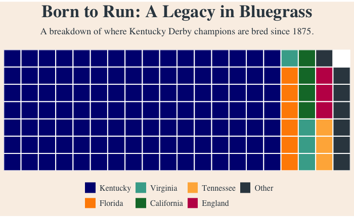
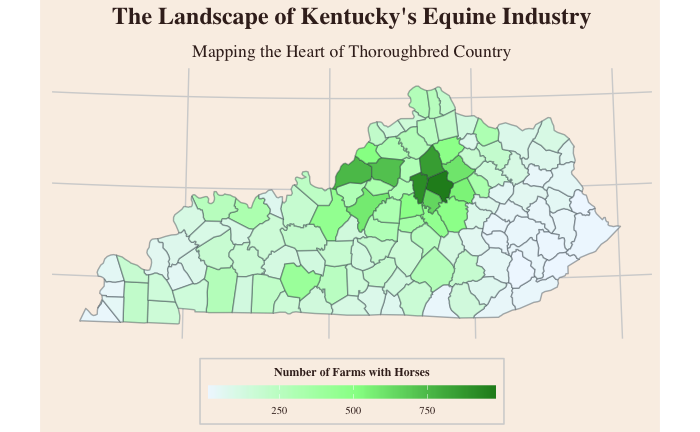
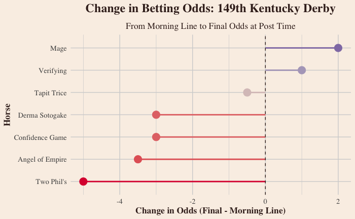

# 🏇 Kentucky Derby Color Palettes for R

*"The most exciting two minutes in Kentucky data visualization!"*

**A collection of color palettes inspired by the pageantry, tradition, and natural beauty of the Kentucky Derby and the Bluegrass State**


[](https://www.r-project.org/)
[](LICENSE)
[](##available-palettes)

## 📋 Table of Contents

- [Installation](#installation)
- [Quick Start](#quick-start)
- [Color Collections](#color-collections)
- [Palette Gallery](#palette-gallery)
- [Usage Examples](#usage-examples)
- [Colorblind-Safe Options](#colorblind-safe-options)
- [Advanced Features](#advanced-features)

## Installation


```r
# First, install the 'remotes' package if you haven't already
if (!requireNamespace("remotes", quietly = TRUE)) {
  install.packages("remotes")
}

# Now, install the kentuckyderby package from GitHub
remotes::install_github("trevorwrobleski/kentuckyderby")

# Finally, load the package
library(kentuckyderby)
```

## Quick Start

```r
# Load required libraries
library(ggplot2)
library(scales)

# Source the palette
source("kentuckyderby.R")

# View main palettes
demo_derby_palettes()

# Use in a plot
ggplot(mpg, aes(displ, hwy, color = class)) +
  geom_point(size = 3) +
  scale_color_derby("classic_silks") +
  derby_theme()
```

## Color Collections

The package includes 46 carefully curated colors inspired by Kentucky Derby traditions:

### Traditional Silks
 `#DC143C` - The iconic red of Churchill Downs  
 `#C21E56` - Deep rose garland hue  
 `#F479A1` - Vibrant jockey silk pink  
 `#FFB6C1` - Delicate rose petal  
 `#FF6B35` - Bold racing orange  
 `#FFD700` - Winner's gold  
 `#00A86B` - Classic racing green  
 `#191970` - Deep evening blue  
 `#6B3AA0` - Regal purple  
 `#FFFFFF` - Clean silk white  
 `#0A0A0A` - Bold contrast black  

### Famous Farms
 `#8B0000` - Historic Calumet Farm red  
 `#000080` - Calumet's signature blue  
 `#006847` - Keeneland's distinctive green  
 `#FF6600` - Keeneland's bright orange  
 `#D3C7B8` - Limestone architecture  
 `#FF4500` - Claiborne Farm orange  
 `#000000` - Pure black accent  

### Kentucky Landscape
 `#7CFC00` - Fresh spring grass  
 `#228B22` - Rich bluegrass  
 `#355E3B` - Shaded pasture  
 `#F0F8FF` - Dawn mist  
 `#FAF0E6` - Kentucky limestone  
 `#D3D3D3` - Weathered stone  
 `#8B4513` - Rich leather  

### Bourbon Heritage
 `#3E2723` - Charred oak barrel  
 `#B87333` - Distillery copper  
 `#FF8C00` - Aged bourbon  
 `#FFB347` - Golden bourbon  

### Equestrian Tack

#### Pinks & Reds
 `#DDBCB4` - Porcelain blush leather  
 `#E1B2A0` - Shell pink saddle dye  
 `#D2A49B` - Baltic rose patina  
 `#EB655A` - Horizon rose lacquer  
 `#EE7E3D` - Box-orange enamel accent  
 `#EA562C` - Poppy orange highlight  
 `#E34B61` - Incarnadine ribbon dye  
 `#DA3037` - Exotic red enamel  
 `#A56969` - Tamisé rose suede  
 `#C82A20` - Casaque red livery  
 `#DA3655` - Indian rose dye  
 `#C14034` - Burnt orange bridle  
 `#CD3B5C` - Magenta rose  
 `#BE2920` - Amazone red tack  
 `#C52A3A` - Pomegranate red  
 `#B8262A` - Chili red accent  
 `#590F10` - Deep oxblood core  
 `#755151` - Muted saddle rose  

#### Greens & Blues
 `#2B6651` - Egyptian green leather  
 `#19413E` - Scottish green tweed  
 `#21213A` - Inkwell midnight blue  
 `#33485D` - Dark agate blue  
 `#42576C` - Light agate blue  
 `#48474D` - Indigo steel  
 `#51524C` - Deep moss green  

#### Neutrals & Accents
 `#D9A447` - Imperial bridle gold  
 `#9A816B` - Classic étoupe grain  
 `#817269` - Taupe saddle  
 `#3C1122` - Byzantine violet  
 `#3C2D26` - Bistre brown leather  
 `#413C39` - Ebony edge paint  
 `#212121` - Jet black  
 `#4D494E` - Slate hardware  

#### Custom Warm/Cool
 `#C96051` - Warm terracotta  
 `#831E12` - Rust cinch  
 `#AB2D26` - Brick girth  
 `#C1765E` - Sienna bridle oil  
 `#323727` - Deep field green  
 `#4A591D` - Olive turf  
 `#3C354B` - Twilight blue-violet  
 `#375E8E` - Cobalt reins  
 `#CBDB9D` - Pasture mint  

## Palette Gallery

The palettes are divided into three types: **Qualitative** for categorical data, **Sequential** for gradients representing low-to-high values, and **Diverging** for data with a meaningful midpoint.

### Color Groups
The core colors are organized into thematic groups.

| Traditional Silks | Bourbon Heritage | Famous Farms | Kentucky Landscape |
| :---: | :---: | :---: | :---: |
|  |  |  |  |

<br>

### Qualitative Palettes (Categorical Data)
These palettes are designed for discrete categorical data where colors need to be distinct.

| Palette Name | Description | Visualization |
| :--- | :--- | :--- |
| **`traditional_silks`** | The full range of 11 classic jockey silk colors. |  |
| **`bourbon_heritage`** | 4 rich, distillery-inspired earth tones. |  |
| **`classic_silks`** | A refined selection of 7 traditional jockey silk colors. |  |
| **`derby_day`** | Festive palette capturing the pageantry of Derby Day. |  |
| **`kentucky_farms`** | Colors inspired by the historic horse farms of the Bluegrass. |  |
| **`famous_farms`** | A 7-color palette from historic Kentucky horse farms. |  |
| **`versailles_landscape`** | 11 colors drawn from natural Kentucky scenery. |  |
| **`phd_stakes`** | A 15-color palette designed for academic presentations. |  |
| **`rolling_hills`** | A comprehensive 17-color landscape palette. |  |
| **`the_paddock`** | The ultimate versatile palette with 21 distinct colors. |  |
| **`jockey_silks_cb`** | 8-color **colorblind-safe** palette (Okabe-Ito based). |  |
| **`twin_spires_cb`** | 10-color **colorblind-safe** palette (Paul Tol inspired). |  |
| **`winners_circle_cb`**| An extended 12-color **colorblind-safe** palette. |  |
| **`equestrian_tack_reds`**| An extended 12-color **colorblind-safe** palette. |  |

### Sequential Palettes (Continuous Data)
Use these smooth gradients for continuous data that progresses from low to high.

| Palette Name | Description | Visualization |
| :--- | :--- | :--- |
| **`run_for_roses`** | White → Pink → Deep Red |  |
| **`bluegrass_morning`** | Mist → Mint → Deep Green |  |
| **`bourbon_sunset`** | Light → Gold → Dark Brown |  |
| **`midnight_fade`** | Lavender → Midnight Blue → Black |  |
| **`rose_fade`** | Light pink -> Pink -> Oxblood |  |
| **`forest_night`** | Vert Egyptien -> Ecossais -> Bleu Encre |  |


### Diverging Palettes (Data with a Midpoint)
These palettes are ideal for visualizing data that deviates from a central value (like zero).

| Palette Name | Description | Visualization |
| :--- | :--- | :--- |
| **`roses_to_mint`** | Red ← White → Green |  |
| **`derby_rivalry`** | Red ← Gray → Blue |  |
| **`sunrise_churchill`** | **Colorblind-safe**: Purple ← Mist → Gold |  |
| **`blue_orange_derby`** | **Colorblind-safe**: Blue ← White → Orange |  |
| **`equestrian_orange_blue`** | **Colorblind-safe**: Orange ← White → Blue |  |

## Usage Examples

### Basic Usage

```r
# Get a palette
colors <- derby_palette("classic_silks")

# Specify number of colors
colors <- derby_palette("derby_day", n = 5)

# Get colorblind-safe version
colors <- derby_palette("classic_silks", colorblind = TRUE)
```

### With ggplot2

```r
# Discrete scales
ggplot(data, aes(x, y, color = category)) +
  geom_point() +
  scale_color_derby("kentucky_farms")

# Sequential scales
ggplot(data, aes(x, y, fill = value)) +
  geom_tile() +
  scale_fill_derby_seq("bourbon_sunset")

# Diverging scales
ggplot(data, aes(x, y, fill = difference)) +
  geom_tile() +
  scale_fill_derby_div("roses_to_mint")
```

### Complete Themed Plot

```r
# Create a publication-ready plot
example_derby_plot("the_paddock", colorblind = FALSE)

# Or build your own
ggplot(iris, aes(Sepal.Length, Sepal.Width, color = Species)) +
  geom_point(size = 3) +
  scale_color_derby("classic_silks") +
  derby_theme() +
  labs(title = "Iris Dataset",
       subtitle = "Styled with Kentucky Derby Colors")
```

## Example Visualizations

This gallery showcases plots created using the `kentuckyderby` color palettes and theme.

---

### Waffle Chart: Breeding Grounds of Champions

This waffle chart uses a custom categorical palette to effectively illustrate the overwhelming dominance of Kentucky as the breeding ground for Derby winners since 1875. Each square represents one champion to compare different breeding locations.



```r
# Create the waffle chart with custom aesthetics
waffle(
  breeding_wins, 
  rows = 7, 
  size = 0.7, 
  colors = custom_colors,
  legend_pos = "bottom"
) +
  
  # Use labs() to set the title and subtitle
  labs(
    title = "Born to Run: A Legacy in Bluegrass",
    subtitle = "A breakdown of where Kentucky Derby champions are bred since 1875."
  ) +

  # Apply custom theme elements
  theme(
    plot.background = element_rect(fill = derby_colors$limestone_white, color = NA),
    panel.background = element_rect(fill = derby_colors$limestone_white, color = NA),
    plot.title = element_text(hjust = 0.5, size = 26, face = "bold", 
                              family = "serif", color = derby_colors$charcoal_rail),
    plot.subtitle = element_text(hjust = 0.5, size = 14,
                                 family = "serif", color = derby_colors$charcoal_rail,
                                 margin = margin(t = 5, b = 20)),
    legend.text = element_text(family = "serif", color = derby_colors$charcoal_rail, size = 12),
    legend.background = element_rect(fill = derby_colors$limestone_white),
    legend.key = element_rect(fill = derby_colors$limestone_white)
  )
```

---

### Choropleth Map: The Heart of Horse Country

This choropleth map shows the concentration of horse farms across Kentucky's counties. It uses the `bluegrass_morning` sequential palette to visually represent the density of the equine industry, highlighting the central Bluegrass region as the heart of thoroughbred country.



```r
ggplot(kentucky_map_data, aes(x = long, y = lat, group = group)) +
  geom_polygon(aes(fill = farm_count), color = alpha(derby_colors$charcoal_rail, 0.4)) +
  scale_fill_derby_seq(
    palette = "bluegrass_morning",
    name = "Number of Farms with Horses", # Title for the legend
    na.value = "grey90",
    labels = comma,
    # Make the legend bar horizontal and adjust size
    guide = guide_colorbar(
      barwidth = 15, 
      barheight = 0.7, 
      title.position = "top",
      title.hjust = 0.5 # Center the title over the bar
    )
  ) +
  coord_map(projection = "albers", lat0 = 36, lat1 = 39) +
  derby_theme() +
  labs(
    title = "The Landscape of Kentucky's Equine Industry",
    subtitle = "Mapping the Heart of Thoroughbred Country"
  ) +
  theme(
    axis.title = element_blank(),
    axis.text = element_blank(),
    axis.ticks = element_blank(),
    panel.grid = element_blank(),
    # Position the legend at the bottom
    legend.position = "bottom",
    legend.direction = "horizontal",
    legend.title = element_text(size = 9), # Slightly smaller title text
    legend.text = element_text(size = 8)   # Slightly smaller label text
  )
```

---

### Lollipop Chart: Betting Odds Shift

This lollipop chart highlights how betting odds changed for key contenders in the 149th Kentucky Derby (2023), from the morning line to the final odds. The plot uses the diverging `derby_rivalry` palette to clearly distinguish between horses whose odds shortened (blue) versus those that drifted out (red).



```r
# Plot the odds change
ggplot(derby_odds_2023, aes(x = reorder(Horse, OddsChange), y = OddsChange, color = OddsChange)) +
  geom_segment(aes(xend = reorder(Horse, OddsChange), yend = 0), linewidth = 1) +
  geom_point(size = 5) +
  scale_color_derby_div(palette = "derby_rivalry") +
  coord_flip() +
  derby_theme() +
  labs(
    title = "Change in Betting Odds: 149th Kentucky Derby",
    subtitle = "From Morning Line to Final Odds at Post Time",
    x = "Horse",
    y = "Change in Odds (Final - Morning Line)"
  ) +
  theme(legend.position = "none") +
  geom_hline(yintercept = 0, linetype = "dashed", color = derby_colors$barrel_char)
```

### Additional Examples to Try
```r
# Bar chart with farm colors
ggplot(mpg, aes(class, fill = class)) +
  geom_bar() +
  scale_fill_derby("kentucky_farms") +
  derby_theme() +
  theme(legend.position = "none")

# Heatmap with sequential palette
ggplot(faithfuld, aes(waiting, eruptions, fill = density)) +
  geom_tile() +
  scale_fill_derby_seq("bourbon_sunset") +
  derby_theme()

# Scatter plot with colorblind-safe palette
ggplot(iris, aes(Sepal.Length, Petal.Length, color = Species)) +
  geom_point(size = 3, alpha = 0.8) +
  scale_color_derby("jockey_silks_cb") +
  derby_theme()
```

## Colorblind-Safe Options

The package includes three colorblind-optimized palettes based on established research:

1. **`jockey_silks_cb`** - Based on Okabe-Ito palette
2. **`twin_spires_cb`** - Inspired by Paul Tol's schemes
3. **`winners_circle_cb`** - Extended 12-color safe palette

Additionally, most palettes can be used with `colorblind = TRUE`:

```r
# Automatic colorblind-safe substitution
scale_color_derby("classic_silks", colorblind = TRUE)
```

## Advanced Features

### Custom Theme

The `derby_theme()` function provides a complete ggplot2 theme:

```r
ggplot(data, aes(x, y)) +
  geom_point() +
  derby_theme(base_size = 14)
```

Features:
- Limestone white background
- Serif typography
- Subtle grid lines
- Themed facet strips
- Professional appearance

### Line Types and Shapes

Thematically appropriate line types and point shapes:

```r
# Access Derby-themed aesthetics
derby_linetypes  # 6 line patterns
derby_shapes     # 8 point shapes

# Use in plots
ggplot(data, aes(x, y, linetype = group, shape = group)) +
  geom_line() +
  geom_point() +
  scale_linetype_manual(values = derby_linetypes) +
  scale_shape_manual(values = derby_shapes)
```

### Palette Exploration

```r
# List all available palettes
list_derby_palettes()

# View specific palette
show_derby_palette("bourbon_heritage")

# Demo all palettes
demo_all_derby_palettes()

# Get palette info
length(derby_palette("the_paddock"))  # Number of colors
```

## Citation

If you use this package in your work, please cite:

```bibtex
@software{kentuckyderby2025,
  author = {Trevor Wrobleski},
  title = {kentuckyderby: Kentucky Derby-Inspired Color Palettes for R},
  year = {2025},
  url = {https://github.com/trevorwrobleski/kentuckyderby}
}
```

## License

This project is licensed under the MIT License - see the LICENSE file for details.

## Run for the Colors!

I hope you enjoy data visualizations with the pageantry and tradition of the Kentucky Derby.
