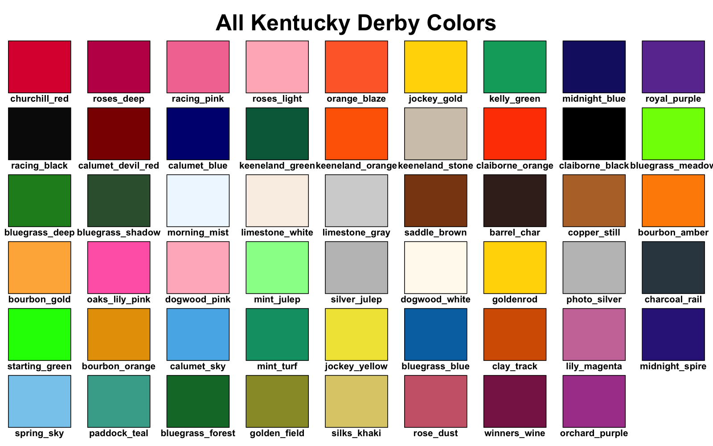
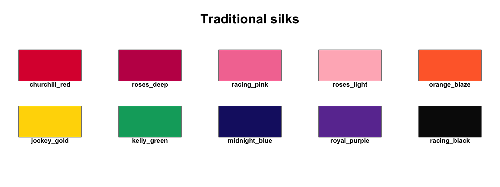
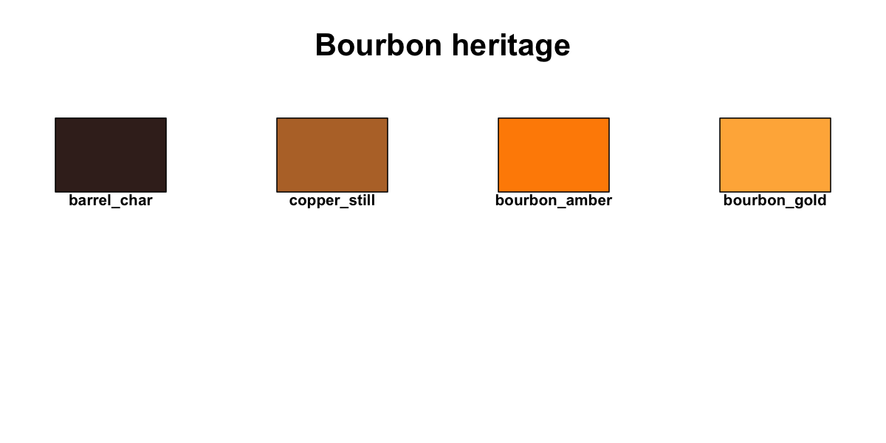
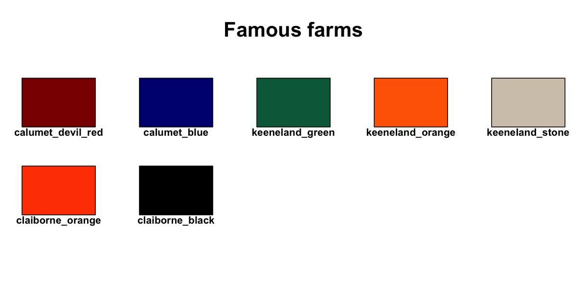
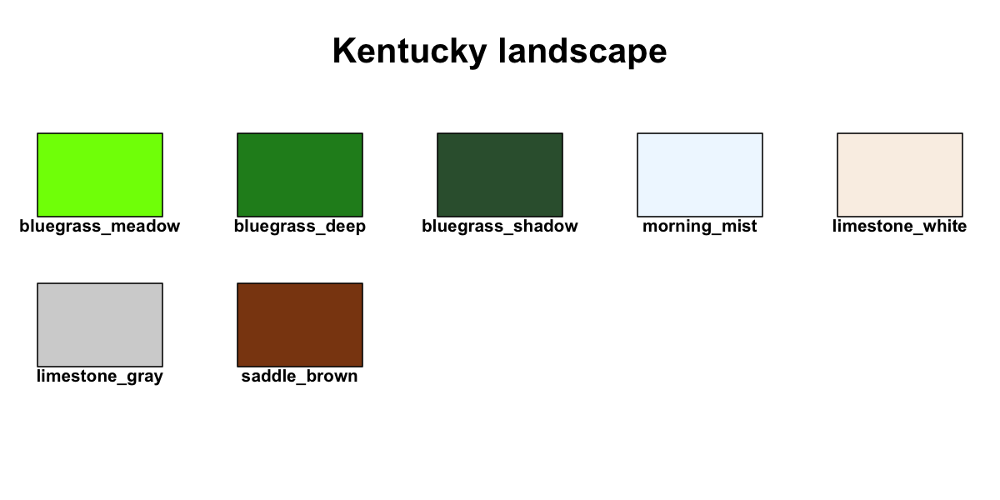
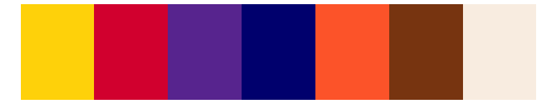
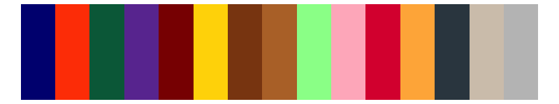
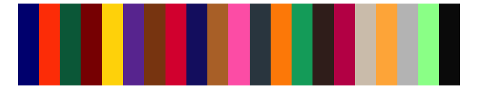

# 🏇 Kentucky Derby Color Palettes for R

*"The most exciting two minutes in Kentucky data visualization!"*

**A collection of color palettes inspired by the pageantry, tradition, and natural beauty of the Kentucky Derby and the Bluegrass State**



[](https://www.r-project.org/)
[](LICENSE)
[](##available-palettes)

## 📋 Table of Contents

- [Installation](#installation)
- [Quick Start](#quick-start)
- [Color Collections](#color-collections)
- [Palette Gallery](#palette-gallery)
- [Usage Examples](#usage-examples)
- [Colorblind-Safe Options](#colorblind-safe-options)
- [Advanced Features](#advanced-features)

## Installation

```r

** TO DO **

```

## Quick Start

```r
# Load required libraries
library(ggplot2)
library(scales)

# Source the palette
source("kentuckyderby.R")

# View main palettes
demo_derby_palettes()

# Use in a plot
ggplot(mpg, aes(displ, hwy, color = class)) +
  geom_point(size = 3) +
  scale_color_derby("classic_silks") +
  derby_theme()
```

## Color Collections

The package includes 46 carefully curated colors inspired by Kentucky Derby traditions:

### Traditional Silks
 `#DC143C` - The iconic red of Churchill Downs  
 `#C21E56` - Deep rose garland hue  
 `#F479A1` - Vibrant jockey silk pink  
 `#FFB6C1` - Delicate rose petal  
 `#FF6B35` - Bold racing orange  
 `#FFD700` - Winner's gold  
 `#00A86B` - Classic racing green  
 `#191970` - Deep evening blue  
 `#6B3AA0` - Regal purple  
 `#FFFFFF` - Clean silk white  
 `#0A0A0A` - Bold contrast black  

### Famous Farms
 `#8B0000` - Historic Calumet Farm red  
 `#000080` - Calumet's signature blue  
 `#006847` - Keeneland's distinctive green  
 `#FF6600` - Keeneland's bright orange  
 `#D3C7B8` - Limestone architecture  
 `#FF4500` - Claiborne Farm orange  
 `#000000` - Pure black accent  

### Kentucky Landscape
 `#7CFC00` - Fresh spring grass  
 `#228B22` - Rich bluegrass  
 `#355E3B` - Shaded pasture  
 `#F0F8FF` - Dawn mist  
 `#FAF0E6` - Kentucky limestone  
 `#D3D3D3` - Weathered stone  
 `#8B4513` - Rich leather  

### Bourbon Heritage
 `#3E2723` - Charred oak barrel  
 `#B87333` - Distillery copper  
 `#FF8C00` - Aged bourbon  
 `#FFB347` - Golden bourbon  

## Palette Gallery

The palettes are divided into three types: **Qualitative** for categorical data, **Sequential** for gradients representing low-to-high values, and **Diverging** for data with a meaningful midpoint.

### Color Groups
The core colors are organized into thematic groups.

| Traditional Silks | Bourbon Heritage | Famous Farms | Kentucky Landscape |
| :---: | :---: | :---: | :---: |
|  |  |  |  |

<br>

### Qualitative Palettes (Categorical Data)
These palettes are designed for discrete categorical data where colors need to be distinct.

| Palette Name | Description | Visualization |
| :--- | :--- | :--- |
| **`traditional_silks`** | The full range of 11 classic jockey silk colors. |  |
| **`bourbon_heritage`** | 4 rich, distillery-inspired earth tones. |  |
| **`classic_silks`** | A refined selection of 7 traditional jockey silk colors. |  |
| **`derby_day`** | Festive palette capturing the pageantry of Derby Day. |  |
| **`kentucky_farms`** | Colors inspired by the historic horse farms of the Bluegrass. |  |
| **`famous_farms`** | A 7-color palette from historic Kentucky horse farms. |  |
| **`versailles_landscape`** | 11 colors drawn from natural Kentucky scenery. |  |
| **`phd_stakes`** | A 15-color palette designed for academic presentations. |  |
| **`rolling_hills`** | A comprehensive 17-color landscape palette. |  |
| **`the_paddock`** | The ultimate versatile palette with 21 distinct colors. |  |
| **`jockey_silks_cb`** | 8-color **colorblind-safe** palette (Okabe-Ito based). |  |
| **`twin_spires_cb`** | 10-color **colorblind-safe** palette (Paul Tol inspired). |  |
| **`winners_circle_cb`**| An extended 12-color **colorblind-safe** palette. |  |

### Sequential Palettes (Continuous Data)
Use these smooth gradients for continuous data that progresses from low to high.

| Palette Name | Description | Visualization |
| :--- | :--- | :--- |
| **`run_for_roses`** | White → Pink → Deep Red |  |
| **`bluegrass_morning`** | Mist → Mint → Deep Green |  |
| **`bourbon_sunset`** | Light → Gold → Dark Brown |  |
| **`purple_silk`** | Lavender → Purple → Indigo |  |
| **`midnight_fade`** | Lavender → Midnight Blue → Black |  |
| **`golden_silk`** | White → Light Gold → Deep Gold |  |

### Diverging Palettes (Data with a Midpoint)
These palettes are ideal for visualizing data that deviates from a central value (like zero).

| Palette Name | Description | Visualization |
| :--- | :--- | :--- |
| **`roses_to_mint`** | Red ← White → Green |  |
| **`derby_rivalry`** | Red ← Gray → Blue |  |
| **`sunrise_churchill`** | Purple ← Mist → Gold |  |
| **`blue_orange_derby`** | **Colorblind-safe**: Blue ← White → Orange |  |
| **`purple_gold_silk`** | **Colorblind-safe**: Purple ← White → Gold |  |


## Usage Examples

### Basic Usage

```r
# Get a palette
colors <- derby_palette("classic_silks")

# Specify number of colors
colors <- derby_palette("derby_day", n = 5)

# Get colorblind-safe version
colors <- derby_palette("classic_silks", colorblind = TRUE)
```

### With ggplot2

```r
# Discrete scales
ggplot(data, aes(x, y, color = category)) +
  geom_point() +
  scale_color_derby("kentucky_farms")

# Sequential scales
ggplot(data, aes(x, y, fill = value)) +
  geom_tile() +
  scale_fill_derby_seq("bourbon_sunset")

# Diverging scales
ggplot(data, aes(x, y, fill = difference)) +
  geom_tile() +
  scale_fill_derby_div("roses_to_mint")
```

### Complete Themed Plot

```r
# Create a publication-ready plot
example_derby_plot("the_paddock", colorblind = FALSE)

# Or build your own
ggplot(iris, aes(Sepal.Length, Sepal.Width, color = Species)) +
  geom_point(size = 3) +
  scale_color_derby("classic_silks") +
  derby_theme() +
  labs(title = "Iris Dataset",
       subtitle = "Styled with Kentucky Derby Colors")
```

## Colorblind-Safe Options

The package includes three colorblind-optimized palettes based on established research:

1. **`jockey_silks_cb`** - Based on Okabe-Ito palette
2. **`twin_spires_cb`** - Inspired by Paul Tol's schemes
3. **`winners_circle_cb`** - Extended 12-color safe palette

Additionally, most palettes can be used with `colorblind = TRUE`:

```r
# Automatic colorblind-safe substitution
scale_color_derby("classic_silks", colorblind = TRUE)
```

## Advanced Features

### Custom Theme

The `derby_theme()` function provides a complete ggplot2 theme:

```r
ggplot(data, aes(x, y)) +
  geom_point() +
  derby_theme(base_size = 14)
```

Features:
- Limestone white background
- Serif typography
- Subtle grid lines
- Themed facet strips
- Professional appearance

### Line Types and Shapes

Thematically appropriate line types and point shapes:

```r
# Access Derby-themed aesthetics
derby_linetypes  # 6 line patterns
derby_shapes     # 8 point shapes

# Use in plots
ggplot(data, aes(x, y, linetype = group, shape = group)) +
  geom_line() +
  geom_point() +
  scale_linetype_manual(values = derby_linetypes) +
  scale_shape_manual(values = derby_shapes)
```

### Palette Exploration

```r
# List all available palettes
list_derby_palettes()

# View specific palette
show_derby_palette("bourbon_heritage")

# Demo all palettes
demo_all_derby_palettes()

# Get palette info
length(derby_palette("the_paddock"))  # Number of colors
```

## Example Visualizations

```r
# Bar chart with farm colors
ggplot(mpg, aes(class, fill = class)) +
  geom_bar() +
  scale_fill_derby("kentucky_farms") +
  derby_theme() +
  theme(legend.position = "none")

# Heatmap with sequential palette
ggplot(faithfuld, aes(waiting, eruptions, fill = density)) +
  geom_tile() +
  scale_fill_derby_seq("bourbon_sunset") +
  derby_theme()

# Scatter plot with colorblind-safe palette
ggplot(iris, aes(Sepal.Length, Petal.Length, color = Species)) +
  geom_point(size = 3, alpha = 0.8) +
  scale_color_derby("jockey_silks_cb") +
  derby_theme()
```

## Citation

If you use this package in your work, please cite:

```bibtex
@software{kentuckyderby2025,
  author = {Trevor Wrobleski},
  title = {kentuckyderby: Kentucky Derby-Inspired Color Palettes for R},
  year = {2025},
  url = {https://github.com/trevorwrobleski/kentuckyderby}
}
```

## License

This project is licensed under the MIT License - see the LICENSE file for details.

## Run for the Colors!

I hope you enjoy data visualizations with the pageantry and tradition of the Kentucky Derby.
